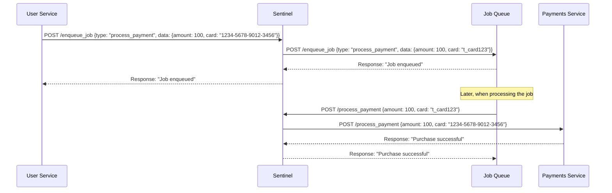

# Sentinel

Sentinel is a low-latency tokenization proxy designed to achieve complete data localization when interacting with external servers. It acts as a secure intermediary, masking sensitive data transparently on its way to the destination and replacing the tokenized data on its way back.


## Key Features

- **Zero Runtime Dependencies**: Sentinel is built to be lightweight and efficient.
- **Low Latency**: Designed for high-performance scenarios where speed is crucial.
- **Flexible Tokenization**: Masks JSON strings and integers while forwarding requests to a destination server.
- **Transparent De-tokenization**: Automatically unmasks data on the return journey.
- **Configurable Routes**: Easily set up different handling strategies for various API endpoints.

## Why

Sentinel can ensure that external systems such as Job Queues that doesn't need to perform aggregations on payloads can hold sensitive data in plaintext, while clients don't need to worry about in-process encryption, or storing tokens.

## How It Works

Think of Sentinel as a coat checker for your data. When you send a request:

1. Sensitive data is replaced with tokens (like checking your coat and receiving a ticket).
2. The tokenized request is forwarded to the destination server.
3. When the response comes back, Sentinel replaces the tokens with the original sensitive data (like using your ticket to retrieve your coat).



This process ensures that sensitive information never leaves your premises in its original form.

## Primary Use Case

Sentinel was developed with a specific use case in mind: allowing all customer data to be kept on-premises for [Inferable](https://www.inferable.ai). This enables:

- Inference and result aggregation to happen on-premise.
- Orchestration to occur with Inferable control plane by referring to individual data bits as tokens.
- Customer data to never leave the premises in its original form.

## Configuration

Sentinel uses a flexible configuration system that allows you to define:

- Routes and their corresponding HTTP methods
- Path matching rules
- Custom request and response body handlers

For example configurations, see the `pkg/strategies` directory.

## Development

To run Sentinel in development mode with hot reloading:

```bash
./scripts/dev.sh
```
